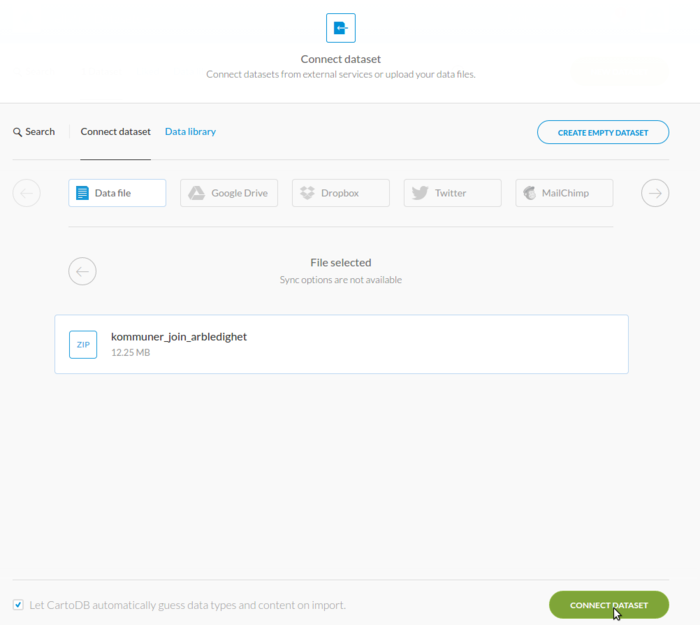

# Veiledning nr 2

<link rel="stylesheet" type="text/css" href="css/md.css">

## Få tak i data

Formålet med denne veiledning er å lage et kart som visualiserer fordeling av "arbeidsledighet" for kommuner i Norge. 

Nødvendig kode og filer er tilgjengelig på [github](https://github.com/GeoForum/veiledning02). Du kan bygge opp filstrukturen selv eller bruke filene i denne veiledning. Se dette eksemplet <a href="http://geoforum.github.io/veiledning02/" target="_blank">live demo på github pages</a>.

Følge evt [denne instruks](testserver.md) hvis du vil sette opp lokal test-server.

### Data fra kommune-helse
Data kan lastes ned her http://khs.fhi.no/ - se bilde:

Velg arbeidsledighet til venstre og velg områder - vi ønsker å bruke data fra alle kommuner, så du kan klikke "Velg alle" - og velg deretter "Hele landet" og fylkene fra. Last ned data som excel ark ved å klikke på "Eksporter til regneark". Det samme gjøres med data for "Helse og sykdom - Sykdomsgrupper - Dødelighet" og for "Vaksinasjonsdekning".

Åpen data med regnearks-programm, fx Libre Office Calc eller Excel - se bilde:

Du vil se at data begynner på linje 10 med overskrifter på hhv linje 8 og 9. Vi må ha overskriftene på samme linje, før vi ekporterer til CSV format. Velg "Save as - CSV" og husk å velge "Quote all text cells" når det eksporteres:

Data er nå klar for å bli hentet inn i andre applikasjoner og ser slik ut - [data/Arbeidsledighet.csv](data/Arbeidsledighet.csv):

### Data fra Kartverket
Vi trenger et kart med kommunegrenser i Norge - det kan lastes ned fra Kartverket her:
http://data.kartverket.no/download/content/administrative-enheter-norge-wgs-84-hele-landet-geojson

For å laste ned fra Kartverket, må du først [opprette ny bruker](http://data.kartverket.no/download/user/register) og logge inn. Klikk på "Legg i kurv > Se kurven > Bestill > laste ned filene her > Download" og du kan nå lagre data i geojson format, ligger her som [data/kommuner.geojson](data/kommuner.geojson).

## Join data

Vi har nå to datasett - et fra Kartverket med kommunenenes geometri til visning på kart og et med arbeidsledighet på kommunenivå fra Folkehelseinstituttet. Data kan joines på forskjellige måter - enten i en vanlig database eller i et GIS programm. Den verdien vi har å joine på her er kommunenavnet - da det ikke helt unikt, må vi bruke litt manuell bearbeiding i tillegg.

-- SKRIVES MER OM JOIN HER --

## Visning på CartoDB
For å vise data på et online kart kan vi bruke [CartoDB])() - lag først en konto her:
https://cartodb.com/signup

Gå deretter til datasets og klik "New dataset":
https://ellvtr.cartodb.com/dashboard/datasets/

Pak shape-filene til et zip-arkiv å last det opp - pek til filen og klikk "Connect dataset" - se bilde:

