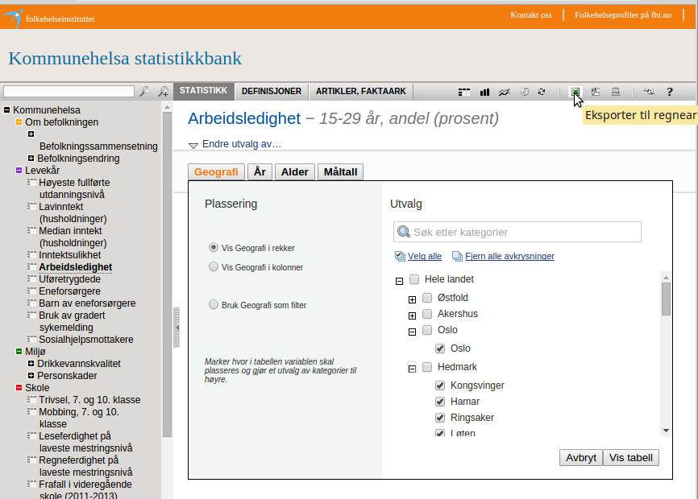
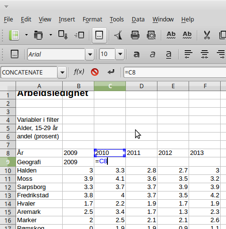
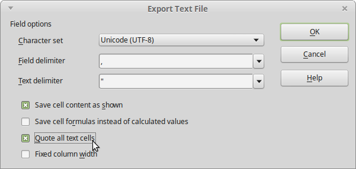

# Veiledning nr 2

## Eksempel 1

Formålet med denne veiledning er å lage et kart som visualiserer fordeling av «arbeidsledighet», «hjerte/karsykdommer», «vaksinasjonsdekning» for kommuner i Norge. 

Nødvendig kode og filer er tilgjengelig på [github](https://github.com/GeoForum/veiledning02). Du kan bygge opp filstrukturen selv eller bruke filene i denne veiledning.

Følge evt [denne instruks](testserver.md) hvis du vil sette opp lokal test-server.

### Datavask
Data kan lastes ned her - se bilde:
http://khs.fhi.no/

Velg arbeidsledighet til venstre og velg områder - vi ønsker å bruke data fra alle kommuner, så vil klikker "Velg alle" - sorter deretter "Hele landet" og fylkene fra. Last ned data som excel ark ved å klikke på "Eksporter til regneark". Det samme gjøres med data for "Helse og sykdom - Sykdomsgrupper - Dødelighet" og for "Vaksinasjonsdekning".

Åpen data i med regnearks-programm, fx Libre Office Calc eller Excel - se bilde.

Du vil se at data starter på linje 10 med overskrifter på hhv linje 8 og 9. Vi må ha overskriftene på samme linje, før vi skal ekporterer til CSV format. Velg "Save as - CSV" og husk å velge "Quote all text cells" når det eksporteres:

### Diverse
Lorem ipsum dolor sit amet, consectetur adipisicing elit. Debitis, porro amet numquam itaque voluptas impedit eos sint voluptatum sit perspiciatis neque nemo similique et ad ipsa, consequatur, adipisci esse ex!