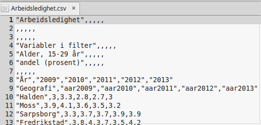
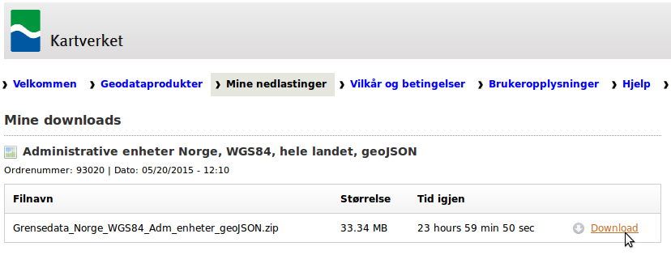

# Veiledning nr 2

## Få tak i data

Formålet med denne veiledning er å lage et kart som visualiserer fordeling av «arbeidsledighet», «hjerte/karsykdommer», «vaksinasjonsdekning» for kommuner i Norge. 

Nødvendig kode og filer er tilgjengelig på [github](https://github.com/GeoForum/veiledning02). Du kan bygge opp filstrukturen selv eller bruke filene i denne veiledning.

Følge evt [denne instruks](testserver.md) hvis du vil sette opp lokal test-server.

### Data fra kommune-helse
Data kan lastes ned her - se bilde:
http://khs.fhi.no/

Velg arbeidsledighet til venstre og velg områder - vi ønsker å bruke data fra alle kommuner, så vil klikker "Velg alle" - sorter deretter "Hele landet" og fylkene fra. Last ned data som excel ark ved å klikke på "Eksporter til regneark". Det samme gjøres med data for "Helse og sykdom - Sykdomsgrupper - Dødelighet" og for "Vaksinasjonsdekning".

Åpen data i med regnearks-programm, fx Libre Office Calc eller Excel - se bilde.

Du vil se at data starter på linje 10 med overskrifter på hhv linje 8 og 9. Vi må ha overskriftene på samme linje, før vi ekporterer til CSV format. Velg "Save as - CSV" og husk å velge "Quote all text cells" når det eksporteres:

Data er nå klar for å bli hentet inn i andre applikasjoner og ser slik ut - [data/Arbeidsledighet.csv](data/Arbeidsledighet.csv):

### Data fra Kartverket
Vi trenger et kart med kommunegrenser i Norge - det kan lastes ned fra Kartverket her:
http://data.kartverket.no/download/content/administrative-enheter-norge-wgs-84-hele-landet-geojson

For å laste ned fra Kartverket, må du først [opprette ny bruker](http://data.kartverket.no/download/user/register) og logge inn. Klikk på "Legg i kurv - Se kurven - Bestill - laste ned filene her - Download" og du kan nå lagre data i geojson format, ligger her som [data/kommuner.geojson](data/kommuner.geojson).

## Join data

Lorem ipsum dolor sit amet.