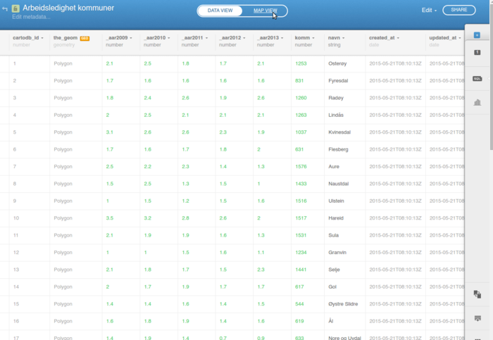
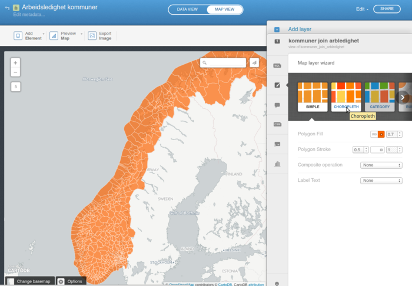
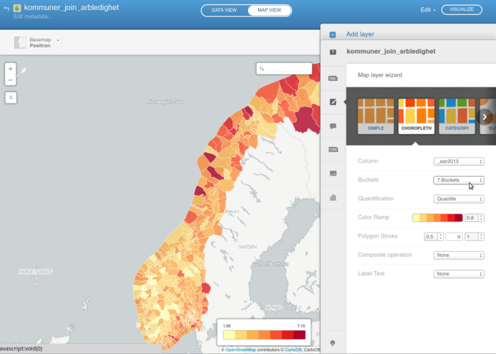
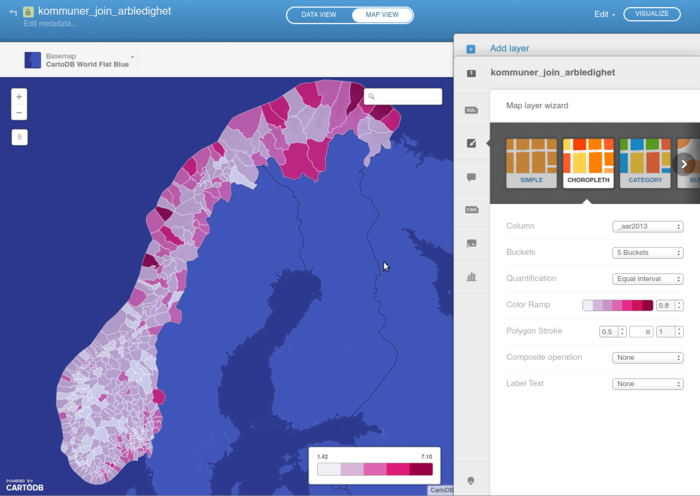
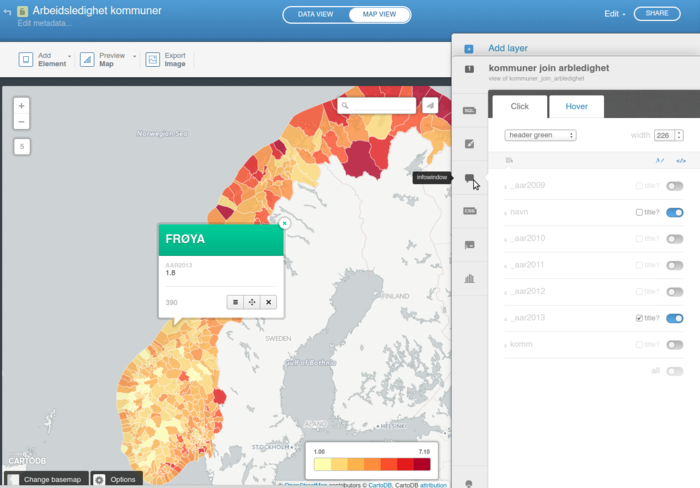
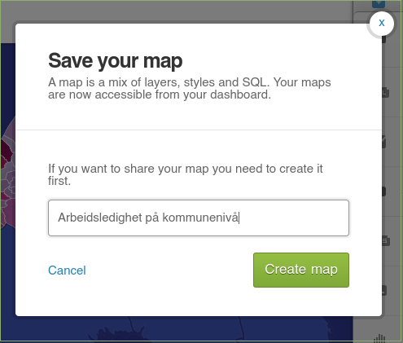
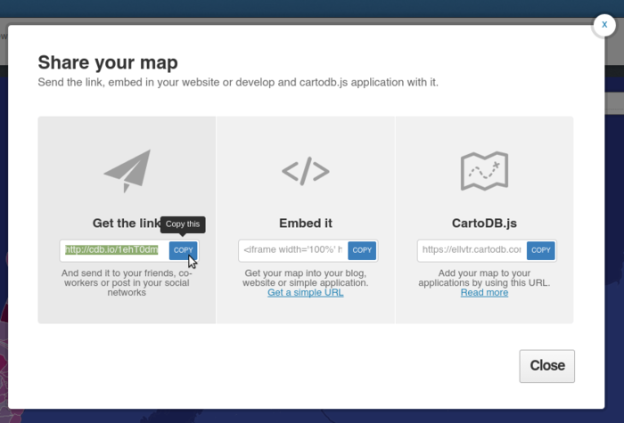

# Veiledning nr 2

<!-- <link rel="stylesheet" type="text/css" href="css/md.css"> -->

## Få tak i data

Formålet med denne veiledning er å lage et kart som visualiserer fordeling av "arbeidsledighet" for kommuner i Norge. 

Nødvendig kode og filer er tilgjengelig på [github](https://github.com/GeoForum/veiledning02). Du kan bygge opp filstrukturen selv eller bruke filene i denne veiledning. Se dette eksemplet <a href="http://geoforum.github.io/veiledning02/" target="_blank">live demo på github pages</a>.

Følge evt [denne instruks](testserver.md) hvis du vil sette opp lokal test-server.

### Data fra kommune-helse
Data kan lastes ned her http://khs.fhi.no/ - se bilde:

Velg arbeidsledighet til venstre og velg områder - vi ønsker å bruke data fra alle kommuner, så du kan klikke "Velg alle" - og velg deretter "Hele landet" og fylkene fra. Last ned data som excel ark ved å klikke på "Eksporter til regneark". Det samme gjøres med data for "Helse og sykdom - Sykdomsgrupper - Dødelighet" og for "Vaksinasjonsdekning".

Åpen data med regnearks-programm, fx Libre Office Calc eller Excel - se bilde:

Du vil se at data begynner på linje 10 med overskrifter på hhv linje 8 og 9. Vi må ha overskriftene på samme linje, før vi ekporterer til CSV format. Velg "Save as - CSV" og husk å velge "Quote all text cells" når det eksporteres:

Data er nå klar for å bli hentet inn i andre applikasjoner og ser slik ut - [data/Arbeidsledighet.csv](data/Arbeidsledighet.csv):

### Data fra Kartverket
Vi trenger et kart med kommunegrenser i Norge - det kan lastes ned fra Kartverket her:
http://data.kartverket.no/download/content/administrative-enheter-norge-wgs-84-hele-landet-geojson

For å laste ned fra Kartverket, må du først [opprette ny bruker](http://data.kartverket.no/download/user/register) og logge inn. Klikk på "Legg i kurv > Se kurven > Bestill > laste ned filene her > Download" og du kan nå lagre data i geojson format, ligger her som [data/kommuner.geojson](data/kommuner.geojson).

## Join data

Vi har nå to datasett - et fra Kartverket med kommunenenes geometri til visning på kart og et med arbeidsledighet på kommunenivå fra Folkehelseinstituttet. Data kan joines på forskjellige måter - [les mer her](join.md).

Ferdig joinet datasett ligger her:
[data/kommuner_join_arbledighet.zip](data/kommuner_join_arbledighet.zip)

## Visning på CartoDB
For å vise data på et online kart kan vi bruke [CartoDB](https://cartodb.com) - lag først en konto her:

https://cartodb.com/signup

Gå deretter til datasets og klik "New dataset":

https://ellvtr.cartodb.com/dashboard/datasets/

Pak shape-filene til et zip-arkiv å last det opp; pek til filen og klikk "Connect dataset" - se bilde:

Når filen er lastet opp vil du se data som en tabell i nettleseren:

Klikk på "Map view" og du vil se data på et kart:

Dette kartet er litt kjedelig å se på. Vi ønsker å se fordeling av arbeidsledighet på kommunenivå, så vi må lage til kartografi som viser forskjellige farger basert på verdier i data - dette kalles også "klassifisering". Velg kolonne du ønsker å klassifisere på: 

Skru evt på andre innstillinger som fx "Buckets", "Quintification", "Color Ramp", "Stroke" mv og velg evt alternativt grunnkart fra "Basemap" over kartet til venstre.

Hvis du ønsker at brukeren skal få opp info når han/hun klikker i kartet, så sett opp "infowindow" "click" og "hover" effect:

Når du er klar til å publisere kartet, klikk på "Visualize" øverst til høyre, skriv et passende navn og klikk på "Share" øverst til høyre:

 

Som det sees finnes forskjellige måter å dele kartet på - enten som simpelt link som tar brukeren til kartet eller en iframe som kan legges på en annen webside - eller integrert med json data som kan hentes inn i en annen applikasjon.

Link til kart: https://geoforum.cartodb.com/viz/32d6c5d8-05fd-11e5-b999-0e9d821ea90d/public_map

Live iframe eksempel på github pages: http://geoforum.github.io/veiledning02/
