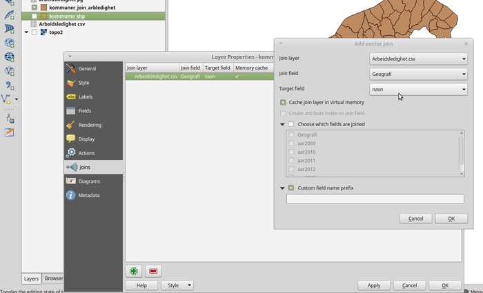

#Join

##Av to kilder uten unik id

Data kan joines på forskjellige måter - enten i en vanlig database eller i et GIS programm. Den verdien vi har å joine på her er kommunenavnet - da det ikke helt unikt, må vi bruke litt manuell bearbeiding i tillegg -

## Join med QGIS
Installer [QGIS](http://qgis.com/) på maskinen og åpen hhv kommunegeometry fra Kartverket og Arbeidsledighet fra Folkehelseinstituttet (CSV) i programmet.

Høyreklikk på laget med kommuner til venstre og velg "Properties" og "Join" og klikk på "+". Velg Join fied "Geografi" og target field "navn" - se bilde:

