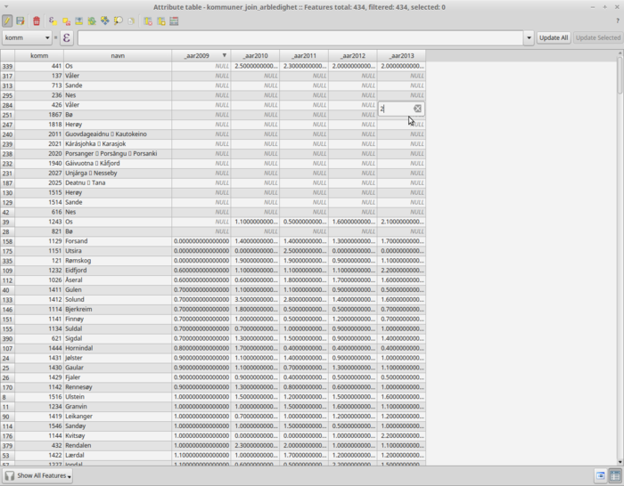

#Join

##Av to kilder uten unik id

Data kan joines på forskjellige måter - bl.a. i en vanlig database eller i et GIS programm. Den verdien vi har å joine på her er kommunenavnet - da det ikke helt unikt, må vi bruke manuell bearbeiding i tillegg.

## Join med QGIS
Installer [QGIS](http://qgis.com/) på maskinen og åpen hhv kommunegeometry fra Kartverket og Arbeidsledighet fra Folkehelseinstituttet (CSV) i programmet.

Høyreklikk på laget med kommuner til venstre og velg "Properties" og "Join" og klikk på "+". Velg Join fied "Geografi" og target field "navn" - se bilde:

 

Etter join sees det at en rekke kommuner ikke matchet tall fra tabellen og verdiene for arbeidsledighet er derfor `null` - se bilder av oversiktskart og tabell:

Bildene nedenfor viser hhv joinet data åpnet i QGIS (som attributt-tabell) og CSV-data med ledighet åpnet i Libre Office Calc:

De kommuner som ikke ble joinet kan finnes i CSV-filen og tilføyes manuellt til joinet data i QGIS. Kommune-data fra Kartverket inneholdt opprinnelig veldig mange kolonner med data som ikke er interessant i denne sammenhengen, og vi har derfor slettet kolonnene manuellt i QGIS. 

Når data er klar kan de lagres separat i fx shape format (formatet består av en rekke filer med forskjellig extension), arkiver som zip og lastes opp til cartodb (cartodb konverterer selv geometri til egen projeksjon og koordinatsystem).

 
